# 1 Edge communication using Predictive and Change Point models in Watson IoT and IBM Data Science Experience (DSX)

Internet of Things (IoT) have evolved tremendously in all spheres of our lives like Industrial  
applications, Social interactions, Remote management of facilities and equipment to name a few.  

In general application areas, IoT data collected by Sensors can be used for monitoring as  
well as predicting the outcomes. If any deviation from the norm is detected, corrective action can be  
prescribed either manually or by an automated process. Such actions may come out of Rule based anomaly  
detection or a Statistical Change point detection or a Predictive model that predicts a faulty  
condition ahead of time.  

The Process steps for applying Analytics on IoT data can be broadly classified as below
1.	Collect IoT data from sensor
2.	Change Point detection using IoT Sensor data
3.	Predicting Equipment failure using IoT Sensor data
4.	Sending Decisions based on Analytics insights to the edge for Automated Action

*This IBM Code Pattern is a composite pattern that brings together the end to end flow of IoT Analytics systems.*  
Specifically focussing on points 2,3,4 above.  

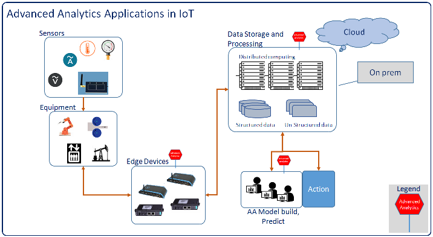  
Image from blog [Advanced Analytics Applications in IoT](https://developer.ibm.com/code/?p=25889)  
  
While Rule based anomaly detection uses point in time data, which may be sudden spike in some parameters  
with a possibility of getting back to normal ranges, statistical Change point detection can differentiate  
and identify a Change in operating parameters that might not return to normal by itself. And so a more  
reliable corrective action can be initiated.  

The Statistical method and flow for detecting change points in IoT Sensor data and related steps are  
covered in the IBM Code pattern below:  
* [Statistical Change point detection - Overview](https://developer.ibm.com/code/journey/detect-change-points-in-iot-sensor-data/)  
* [Statistical Change point detection - Code and HowTo](https://github.com/IBM/detect-timeseriesdata-change)  

One step further, using Advanced Analytics, predictive models can be built that could predict a failure  
condition in an equipment or a system like say a Compressor in a refrigeration unit well ahead of time.  
   
This approach goes a long way in implementing Predictive maintenance which is more prudent approach   
than Scheduled Preventive maintenance which is periodic in nature.  
Predictive Analytics on IoT is covered in the journey below:  
* [Equipment failure Prediction using IoT Sensor data - Overview](https://github.com/IBM/iot-predictive-analytics)
* [Equipment failure Prediction using IoT Sensor data - Code and HowTo](https://github.ibm.com/developer-journeys/si-journey-iot-predictive-analytics)  
 
Also, by using multivariate data collected from different sensors mounted on an equipment, more   
sophisticated Predictive models can be built that can pinpoint upcoming failure of a specific   
equipment or subsystem.  
  
Once an anomaly is detected, a prescriptive action needs to be taken.  
This journey in specific covers, **Detecting the need for any corrective action and then  
communicating Decisions based on Analytics insights to the edge for Automated Action**  

## Prerequisites:  
Users who want to implement this IBM Code pattern are expected to have the below knowledge as  
Pre-requisites. Before proceeding, it is strongly suggested to familiarize yourself with the  
below pre-requisites.  
1.	[Node-RED]( https://nodered.org/):  
    a.	[Creating your first sample flow](https://nodered.org/docs/getting-started/first-flow)  
    b.	[Creating your second sample flow](https://nodered.org/docs/getting-started/second-flow)  
2.	Node-RED in IBM Cloud (previously IBM Bluemix):  
    a.	[Running Node-RED on IBM blue mix](https://nodered.org/docs/platforms/bluemix)  
    b.	[Deploying IoT platform starter on IBMcloud]( https://developer.ibm.com/recipes/tutorials/deploy-internet-of-things-platform-starter-service-on-bluemix/)  
3.	Node-RED on Raspberry Pi:  
    a.	[Running Node-RED on Raspberry Pi](https://nodered.org/docs/hardware/raspberrypi)  
4.	[Configure a Raspberry Pi with Watson IoT Platform and connect it to the cloud](https://www.youtube.com/watch?v=nlvAFwifU9c&feature=youtu.be)  
  

# 2 Flow
  

1.	Temperature Data is read from a sensor attached to an edge device, in our case CPU temperature  
    sensor in Raspberry Pi  
2.	.json files are imported to create 2 Node-RED flows in Raspberry Pi or the Edge layer  
3.	Node-Red ``Emitter`` running on Raspberry Pi will collect the CPU temperature sensor data and dispatch it to  
    IBM IoT service in Cloud. Node-RED ``Collector`` flows in Raspberry Pi will also receive commands for  
	action from IoT platform in IBM Cloud and initiates action  
4.	Node-RED flows running on IBM Internet of Things (IoT) platform in IBM Cloud will receive the data from  
    Raspberry Pi and Analyzes the data to detect if any action needs to be taken at the edge  
5.	.json files will be imported to create the Node-RED flows in the IBM Cloud – IoT service  
6.	Node-RED flows running on IBM IoT platform will once again run the logic on the data and then  
    translate it into an action and communicate the action to be taken back to the edge layer, Raspberry Pi  
7.	Analytics logic to detecting the action to be taken at the Edge will be embedded in the Node-RED  
    flow in IBM Cloud – IoT service  
  
# 3 Included Components 
* [IBM Cloud](https://console.bluemix.net/catalog/): IBM's innovative cloud computing platform or IBM Cloud (formerly Bluemix) combines   
  platform as a service (PaaS) with infrastructure as a service (IaaS) and includes a rich catalog of  
  cloud services that can be easily integrated with PaaS and IaaS to build business applications rapidly.  
* [IBM Watson IoT Platform](https://internetofthings.ibmcloud.com/): IBM Watson™ IoT Platform for IBM Cloud gives you a versatile  
  toolkit that includes gateway devices, device management, and powerful application access. By using  
  Watson IoT Platform, you can collect connected device data and perform analytics on real-time data  
  from your organization.  
* [IBM Data Science Experience](https://www.ibm.com/bs-en/marketplace/data-science-experience): Analyze data using Python, Jupyter Notebook  
  and RStudio in a configured, collaborative environment that includes IBM value-adds, such as managed Spark.  

# 4	Featured Technologies

* [Analytics](https://developer.ibm.com/code/technologies/analytics?cm=IBMCode-_--_-featured_technologies-_-analytics): Finding patterns in data to derive information.  
* [Data Science](https://developer.ibm.com/code/technologies/data-science?cm=IBMCode-_--_-featured_technologies-_-data-science): Systems and scientific methods to analyze structured and unstructured data in  
  order to extract knowledge and insights.  

# 5	Watch the Video  
* [Video](https://youtu.be/2CJcqMPIFaY)  
  
# 6	Steps  

1.	[User sets up Node-RED in Raspberry Pi and connect to Network](#6.1-user-sets-up-node-red-in-raspberry-pi-and-connect-to-network)
2.	User imports Node-RED flows in Raspberry Pi
3.	User configures Emitter, Receiver Node-RED flows in Raspberry Pi
4.	User signs up for IBM Internet of Things Starter service on IBM Cloud
5.	User imports Node-RED flows in IBM IoT Cloud service
6.	User configures Emitter Node-RED flows in IBM IoT Cloud service
7.	User checks the CPU temperature from Raspberry Pi transported to IBM IoT service
8.	[User checks the action received at the Raspberry Pi Edge node from IBM IoT service](#6.6-user-configures-emitter-node-red-flows-in-ibm-iot-cloud-service)

## 6.1	User sets up Node-RED in Raspberry Pi and connect to Network  
Follow this [Video]( https://www.youtube.com/watch?v=nlvAFwifU9c&feature=youtu.be) which will walk you through the below steps.  
1.	Setup and Connect Raspberry Pi to Local Wifi Network with Internet  
2.	Connect the Raspberry Pi to the same WiFi network as your Laptop  
3.	Login to Raspberry Pi from your Laptop using putty or any other SSH  
4.	Start Node-RED service on Raspberry Pi  
5.	Start IoT service in Raspberry Pi if not started already  
6.	On your laptop / desktop web browser, open the Node-RED web editor running on Raspberry by entering the URL  
    `raspberrypi ip address:1880`. In the example shown below the IP address for Raspberry Pi is `192.168.1.26`.  
	You can check your WiFi router (or hotspot) configuration for the finding the Raspberry Pi IP address.  
  
## 6.2  User imports Node-RED flows in Raspberry Pi  

Import “Emitter” Node-RED flow “Rpi2BMX” in Raspberry Pi from [RPi2BMX.json](/configuration/RPi/RPi2BMX.json)  

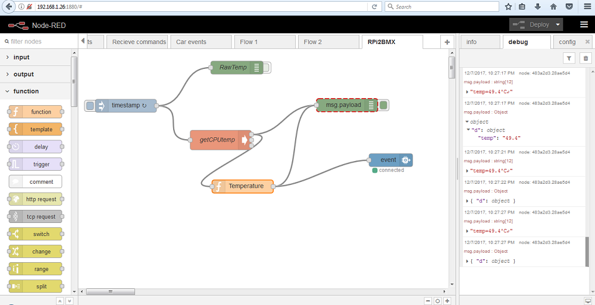  
Leave the tab that shows this flow open.   
 
Import “Collector” Node-RED flow “BMX2RPi” on Raspberry Pi from [BMX2RPi.json](/configuration/RPi/BMX2RPi.json)  

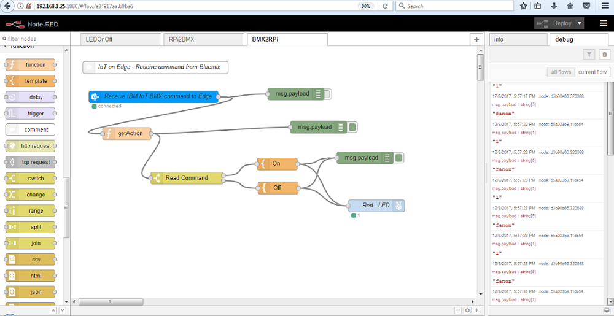  
This will create a second flow "BMX2RPi" in a second tab. Leave this open as well.  
  
## 6.3	User configures Emitter,Receiver Node-RED flows in Raspberry Pi  

* In the flow “Rpi2BMX”, set the Device ID in the “event” IoT output node to “kpedgetobmx20171207”  

* In “BMX2RPi” flow, set the “Device ID” in the “Receive IBM IoT BMX command to Edge” node to “kpbmxtoedge20171207”  

Make a note of the above 2 Device IDs  
You will need them later in Node–RED flow in IBM Cloud  
  
## 6.4	User signs up for IBM Internet of Things Starter service on IBM Cloud  

* Go to [IBM Cloud Catalog]( https://console.bluemix.net/catalog/) and type “node-red” in the search box.  
* This displays a list of components that match the search criteria in IBM Cloud.  
* Select the “Node-RED starter” Service  

  
  
* Fill in the details in the Node-RED service creation page  

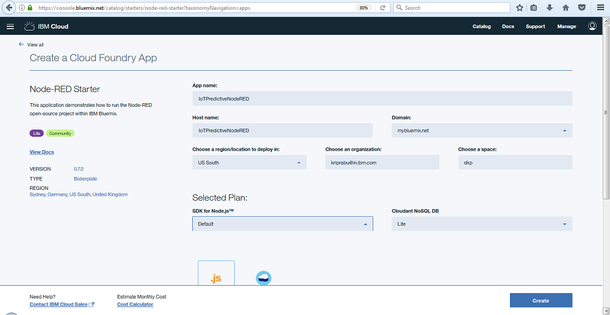   
  
* Select the 30 days trial plan and click `Create`  

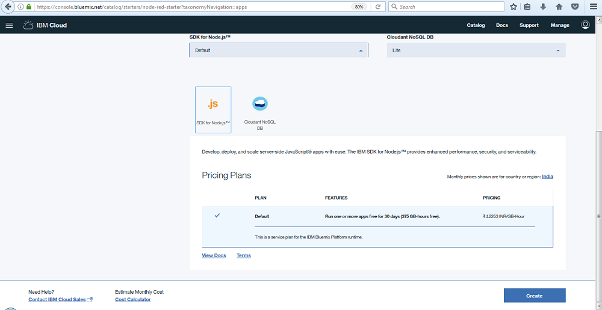    
* The Node-RED service will be created under `Cloud Foundry App` and the service will be started by default.  
* Click on `Visit App URL` in the Service status page.  
* You will be asked for a User ID and password. This is for accessing the Node-RED flows that will be created  
  by you in future.  
* Enter a UserID and password and make a note of it. You will need it later when you relogin and work on your  
  Node-RED flows.  
* In the next page, you will be provided with options for browsing `Available Bluemix nodes`.  

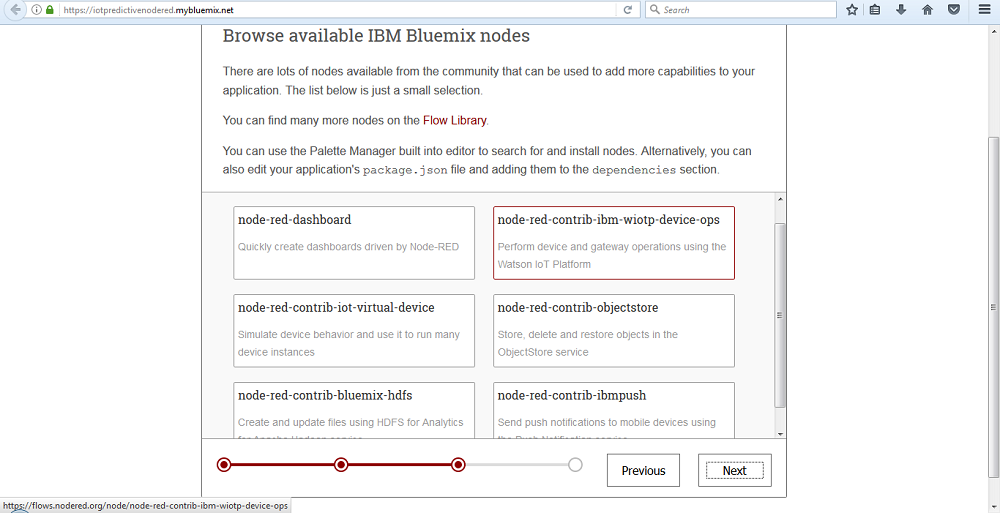   

* Select `node-red-contrib-ibm-wiotp-device-ops` and click `Next`  

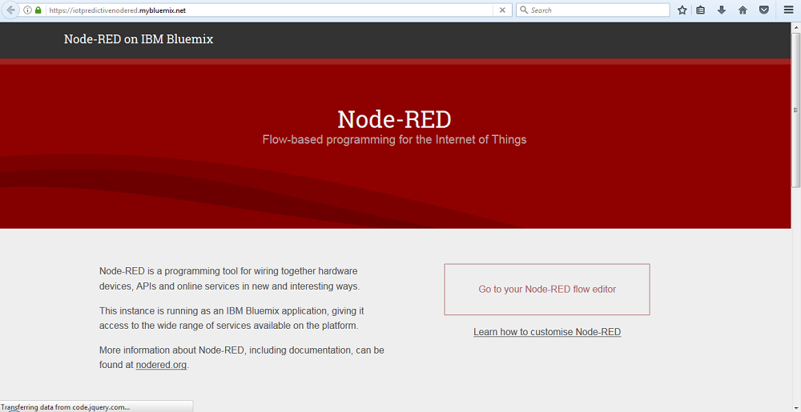   

* Click on `Go to Node-RED flow editor`. You will be presented with a blank Node-RED flow tab   
 
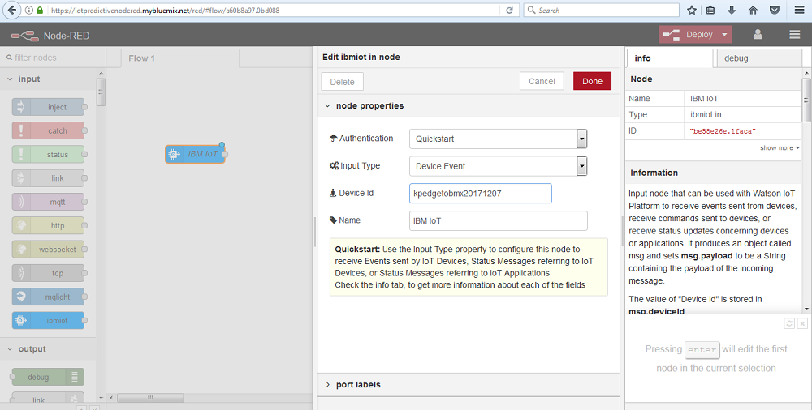   
  
As a trial, drag and drop the input node that says `ibmiot` into the blank tab `Flow 1`.  
You can see a description of the functions of this node. You can experiment further to get yourself comfortable with  
the flow. Discard or Save any flow you might have created, we will be using from pre-built flows that are made available  
in the git repo.  

## 6.5	User imports Node-RED flows in IBM IoT Cloud service  
* Import  the Node-RED flow  “BMXReceiveIoTTemp” from [BMXReceiveProcessIoTTemp.json](/configuration/BMX/BMXReceiveProcessIoTTemp.json)
 
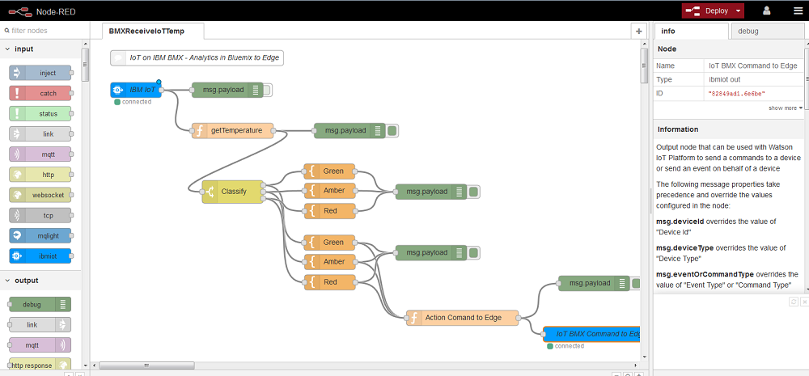   
  

## 6.6	User configures Emitter Node-RED flows in IBM IoT Cloud service  

* Set the “Device ID” in the “ibmiot” node to “kpedgetobmx20171207”   
  This is the node that receives data from Raspberry Pi "Emitter" flow.  

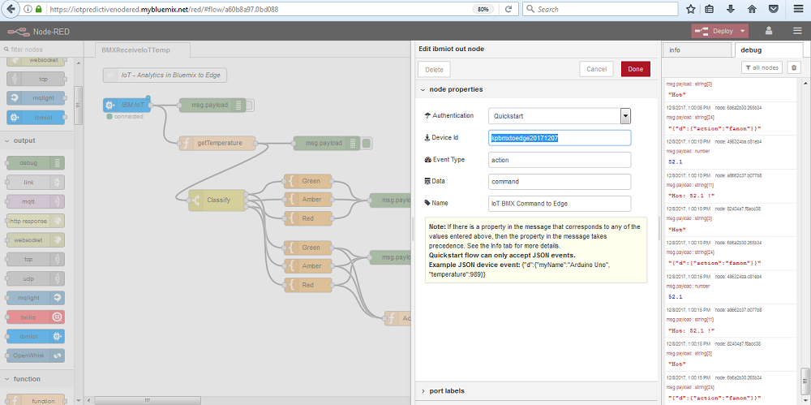    

* Set the “Device ID” in the “IoT BMX Command to Edge” node to “kpbmxtoedge20171207”   
  This is the node that sends data / commands back to Raspberry Pi "Collector" flow.  
  
# 7	Run the Node-RED flows and View the Results
  
_Note: Steps on how to Run the flow is not explained in detail as these are basics covered in the Pre-requisites._  
  
* On RPi: Inject in ``RPi2BMX`` flow and see results in debug screen  
  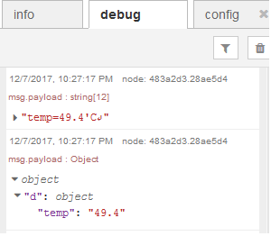   
  You must be able to see the CPU temperature in 'C output in the debug section.   
  
* On BMX: Inject in ``BMXReceiveIoTTemp`` flow and see results in debug screen  
  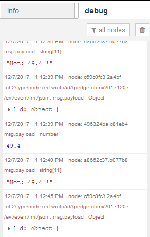   
  You must be able to see the CPU temperature values received from Raspberry Pi.  
  Also, the flow will analyze this temperature using rules and outputs a command `fanon` or `fanoff`   
  depending on the temperature values received.  
  The logic for doing the same is coded in the flow, which you can explore yourself. 
    
  _Note: This logic can be replaced with a complex algorithm that can predict an upcoming failure condition  
  The focus of this Code Pattern is to show the means for implementing the flow and not in the logic itself  
  and so the complexity of the flows are kept to a minimal.  
  Users are encouraged to experiment with coding their own logic that suits their specific requirements._  
  
* On RPi: Inject ``BMX2RPi`` flow and see results in debug screen  
  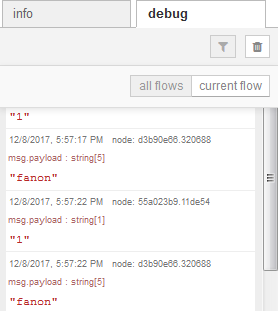   
  In the debug window, you must be able to see the commands received from the IBM Cloud - Node-RED flow  
  
* Confirm the ouputs  

# 8	Troubleshooting  
See [Debugging.md](https://github.com/IBM/iot-edge-predictive-models-dsx/blob/master/DEBUGGING.md)  
  
# 9	License  
See [Apache 2.0](https://github.com/IBM/iot-edge-predictive-models-dsx/blob/master/LICENSE)  
    
# 10	Further enhancements  

The following areas are suggested as further enhancement areas for a User to explore by self.  
These are consciously been omitted from this IBM Code pattern as thse will require additional  
hardware and knowledge of basic electronics  

* Inputs from Raspberry Pi GPIO pins can be used for reading temperature from a external Temperature sensor attached  
* Outputs to Raspberry Pi GPIO pins can be used for triggering action by external actuators  

