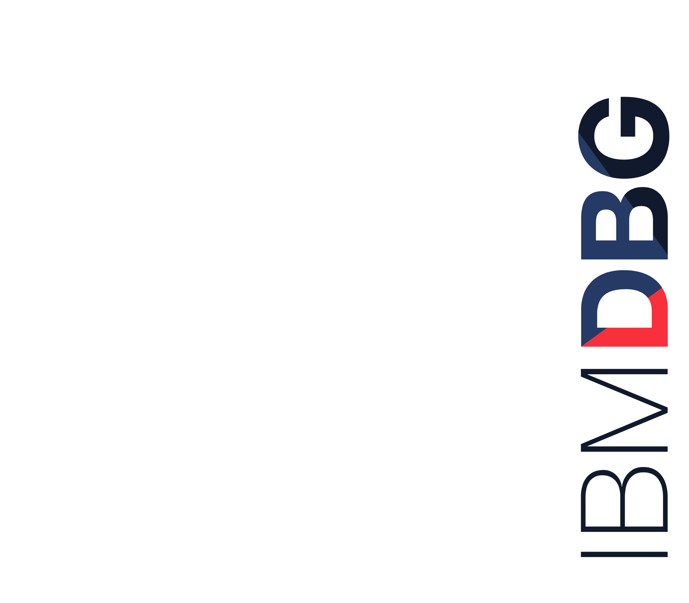

# Edge communication using Predictive and Change Point models in Watson IoT and IBM DSX (IoT)

Offering Managers: Manjula Hosurmath (India Software Labs, SI Labs, Digital Business Group)

Development: Krishna Prabu D (Data &Analytics Scientist, India Software Labs)

May 30, 2018  

&nbsp;
&nbsp;
&nbsp;
&nbsp;

## Overview

Advanced Analytics can be applied in various areas of IoT like “Change Point detection using IoT Sensor data” and “Predictive Analytics using IoT Sensor data”.  
  
Once a Descriptive or Prescriptive model outcome is arrived established, it needs to be translated into action.
This journey demonstrates how such a communication to the Edge layer can be implemented for a “Change Point detection using IoT Sensor data” or a “Predictive Analytics using IoT Sensor data”.  
  

## Architecture Diagram

## IBM Products

* [IBM Watson Studio]( https://datascience.ibm.com/)  
* [IBM Watson]( https://dataplatform.ibm.com/)  
* [Analytics]( https://developer.ibm.com/code/technologies/analytics/?cm=IBMCode-_--_-featured_technologies-_-analytics)  
* [Data Science]( https://developer.ibm.com/code/technologies/data-science/?cm=IBMCode-_--_-featured_technologies-_-data-science)

## Related Technologies

*	Edge communication
*	Node-RED  
  
## Key Features

Equipment Failure Prediction in IBM Watson Data platform, Sensor data collection in Edge using Node-RED, Map corrective action in IBM IoT platform in Watson cloud, Communicate action back to Edge.  
  
## Rationale

Advanced Analytics can be applied in various areas of IoT like “Change Point detection using IoT Sensor data” where Time series data is leveraged and “Predictive Analytics using IoT Sensor data” where multivariate Predictive algorithms are used.  
  
Once a Descriptive or Prescriptive model outcome is established, it needs to be translated into action. For example, if Change point is detected in temperature by the Statistical model in a Cooler unit, then a action need to be initiated to bring the temperature in the unit back to normal. Which can be for example increasing the inlet pressure or increasing the voltage in one of the compressors attached to the unit or rerouting the flow of coolant by activating a solenoid valve etc.,
This translation to action can be either via Human intervention or a completely automated process. In case of the Automated intervention to take Predictive or corrective action, the prescriptive commands need to be passed to the Edge layer and vice-versa.  
  
This journey demonstrates how such a communication to the Edge layer can be implemented for a “Change Point detection using IoT Sensor data” or a “Predictive Analytics using IoT Sensor data”.  
  
Developers need an established method to translate the Predictive results into action and communicate the same to the edge layer. The edge layer which is attached to controllers can then take autonomous action in an Automated or a Mass production environment.  
  
A step by step flow for communication a command to take action at the edge will be shown in this journey.  
 

## Code Pattern Hypothesis

### Opportunity

* This Code Pattern targets Data scientists and IoT solution developers who have already built Statistical model based on IoT Time series data or Predictive models that predicts. And now looking for ways to integrate the outcome of these models to the Edge layer. It helps them to easily integrate the above using Node-red (https://nodered.org/) flows in a Edge layer prototyping environment like Raspberry Pi.  
  
### Operational Efficiency

* It eliminating complexity of acquiring embedded systems knowledge for edge communication  

* This being a 3rd in a series of Composite journeys, helps completes end to end flow of Predictive Advanced Analytics on Edge  
  
### Community and Advocacy

* Analytics, Data Science communities working in the Domain of IoT  
* DevOps conferences with rapid apps focus  
  
### Amplification

* Expand to show other event triggers in the IBM Watson platform – UI layer to develop a full fledged application on top  
* Automated action at the Edge actuator and so seamless integration of Predictive maintenance  
* Mobile app versions with push/simple notification integration  
  
### Competition

*	A User interface on top of this composite pattern will enable transform this into a full fledged Product, Platform  

## Concept

### What is the Code Pattern?
  
Advanced Analytics can be applied in various areas of IoT like “Change Point detection using IoT Sensor data” where Time series data is leveraged and “Predictive Analytics using IoT Sensor data” where multivariate Predictive algorithms are used.
  
Once a Descriptive or Prescriptive model outcome is established, it needs to be translated into action. For example, if Change point is detected in temperature by the Statistical model in a Cooler unit, then a action need to be initiated to bring the temperature in the unit back to normal. Which can be for example increasing the inlet pressure or increasing the voltage in one of the compressors attached to the unit or rerouting the flow of coolant by activating a solenoid valve etc.,
  
This translation to action can be either via Human intervention or a completely automated process. In case of the Automated intervention to take Predictive or corrective action, the prescriptive commands need to be passed to the Edge layer and vice-versa.
  
This journey demonstrates how such a communication to the Edge layer can be implemented for a “Change Point detection using IoT Sensor data” or a “Predictive Analytics using IoT Sensor data”  
  

### Who is it for?

Data scientists and IoT solution developers who have already built Statistical model based on IoT Time series data or Predictive models that predicts. And now looking for ways to integrate the outcome of these models to the Edge layer.  
  
This current implementation is developed using Node-red (https://nodered.org/) flows in a Edge layer prototyping environment like Raspberry Pi  
  
### What will they learn?
  
Developers need an established method to translate the Predictive results into action and communicate the same to the edge layer. The edge layer which is attached to controllers can then take autonomous action in an Automated or a Mass production environment.  
A step by step flow for communication a command to take action at the edge will be shown in this journey.
Data scientist, Developers will learn how to integrate results from IBM Watson  Data platform using Watson IoT services and 2 way communication between Node-Red on a edge device.  
  
## What does it look like?

1.  User sets up Node-RED in Raspberry Pi and connect to Network  
2.	User imports Node-RED flows in Raspberry Pi  
3.	User configures Emitter, Receiver Node-RED flows in Raspberry Pi  
4.	User signs up for IBM Internet of Things Starter service on IBM Cloud  
5.	User imports Node-RED flows in IBM IoT Cloud service  
6.	User configures Emitter Node-RED flows in IBM IoT Cloud service  
7.	User checks the CPU temperature from Raspberry Pi transported to IBM IoT service  
8.	User checks the action received at the Raspberry Pi Edge node from IBM IoT service  
  
# Strategy

## What is the strategy?

Advanced Analytics can be applied in various areas of IoT like “Change Point detection using IoT Sensor data” and “Predictive Analytics using IoT Sensor data”.  
  
Once a Descriptive or Prescriptive model outcome is arrived established, it needs to be translated into action.  
  
This journey demonstrates how such a communication to the Edge layer can be implemented for a “Change Point detection using IoT Sensor data” or a “Predictive Analytics using IoT Sensor data”  
  
## What is the advocacy potential?

This Code Pattern is relevant to Data Science, Advanced Analytics, Predictive maintenance, IoT communities who are looking for developing, implementing platform that collect data from IoT Edge devices and run Predictive Analytics on the data in Cloud and then propogate a corrective action back to the controllers connected to the Edge layer.  
  
## What are some target events or meetups?
  
DevOps, IoT, and Open Source meetups and conferences with rapid app development focus:  
•	DevOps Days (many worldwide)  
•	Container Camp AU  
•	Open Source Summit  
  
## How does this impact the city and community Heat Maps?

This Code Pattern is an opportunity to advocate in IoT communities looking for automating or building a end to end Platform  
  
## What are the key metrics for this Code Pattern?

1. \# Github repo forks
2. \# Deploys to Bluemix
3. \# Readme page views
4. % reduction in churn from monthly active users (MAU) versus non-Code Pattern MAU

